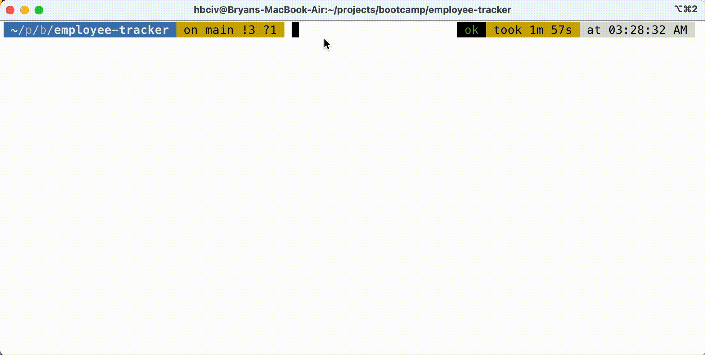
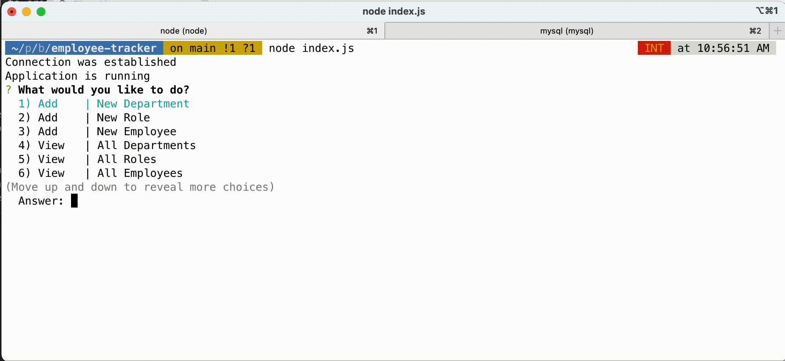
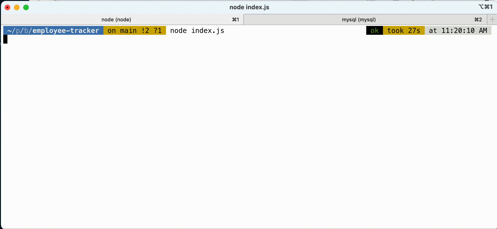

# About employee-tracker

## Background

To better understand server-to-database concepts, relational database design and functions, and gaining further visceral experience with previously used tools Inquirer and Node.js, students were asked to demonstrate their knowledge in these areas by creating a database from scratch, designing tables, seeding the tables with data and then writing an interface through the command line to interface with the data in the database.  The data

Students were asked to create a database using [MySQL](https://www.mysql.com/) to contain data for a hypothetical company with:

* Departments
* Occupational job roles
* Employees

These three tables must be related to each other using Primary and Foreign keys to appropriately handle new record insertions and deletions so that records are not orphaned or compromised.  Data for these tables must also be created or "seeded".

Once the database and data are configured and deployed, a command line interface using Node.js and the [Inquirer](https://www.npmjs.com/package/inquirer) npm package must be created to perform the following CRUD actions across the three database tables:

* Add new department, job role and employee records (`INSERT` statements)
* Modify job role for a given employee (`UPDATE` statement)
* View department, job role and employee records (`SELECT` statement)

## Description

### Database:  Creation, Schema Design

* Implements relational database (MySQL)
* Primarily uses DDL and DML commands
	* All SQL commands written in SQL--no ORMs used
* Three tables required:

	* `department`
	* `role`
	* `employee`

* Schema design:
	

### Database:  Seeding

* `INSERT`s needed for adding demonstration and test data into database
* All seeds provided in single file

### Interface

* Application is started in command line with `node ... .js` command or similar
* User is presented with options to "View...", "Add..." or "Update..." data in any of the three tables
* All prompts display using Inquirer npm package
* User prompts initialize successful `SELECT`, `INSERT` or `UPDATE` commands to the live database

## Installation

1. Access [**employee-tracker** GitHub page](https://github.com/monstertruckdog/employee-tracker) and clone the project
2. Start an instance of MySQL in your environment
3. Access the **employee-tracker** directory and modify the `.env.example` file to include the correct credentials and host information associated with your MySQL instance
4. Rename the `.env.example` file so that it's name reads: `.env`
	* Make sure the `.env` file remains in the root path of the **employee-tracker** directory
5. Use a command line utility program to navigate to the **employee-tracker** directory and execute the following command:

	```
	mysql -u <your username> -p
	```
	* Press the "Enter"/"return" key and enter the password associated with the MySQL instance
6. While in the root directory for **employee-tracker**, and logged into MySQL, load all of the schema build and database seeds by executing the following command:
	
	```
	source db/setup.sql
	```
	* Press the "Enter"/"return" key
	* **The database schema is created and example data is inserted**
7. Open a new tab or window in the command line utility program and navigate to the **employee-tracker** directory again
8. Enter the following command, or similar, to initiate the `index.js` file, which will start the application
9. 
	```
	node index.js
	```
	* **NOTE**:  *Due to an outstanding and unresolved bug, using `nodemon` will not function correctly with Inquirer in this particular project*

9. The application starts on the main prompt window

	* Prompts will appear directing you to take various actions
	* Option "`8`" from the main prompt screen will exit the application


## Highlights and Features

#### Database Connection

* Though not required by the assignment, the `dotenv` npm package was utilized to decentralize database connection information and increase ease of use and security

#### Database Design and Function

* `AUTO_INCREMENT` index values used in the three tables are reset to `1` whenever tables are recreated with the `setup.sql` file to avoid runaway escalating ID values
* Over 30 `SELECT`, `UPDATE`, and `INSERT`queries were written to achieve all the neccessary application actions
* Database query concepts, methods and commands implemented:
	* `INNER JOIN`
	* `LEFT JOIN`
	* sub-queries
	* recursive table joins
	* `CONCAT`
	* `IFNULL`
	* `?` notation
	* `ORDER BY`
	* `DISTINCT`

* For any screen that required the display of `id` values, the associated title, name or description text was always included in a separate adjacent column in the table to improve readibility
* Risk of error or inconsistent data entry during `INSERT` and `DELETE` actions is minimized by implementation of Primary/Foreign Keys and `CASCADE` attribute
* Number of SQL calls reduced by implementation of joins and subqueries

#### Command Line Interface

* `Inquirer` npm package used to create user adequate-looking, responsive 	prompts
* Table results displayed using aesthetically pleasing npm package [`console.table`](https://www.npmjs.com/package/console.table)
* Users are returned to main prompt screen after every action request
* An "Exit" option was included to allow users options of safely closing application
* A summary of the data added or modified after an `UPDATE` or `INSERT` action is displayed to the user in a table
* For user prompts requiring a selection of options that currently exist in the database, logic was written to format selections in a highly readable format
	* *EXAMPLE*:  *Instead of listing `id` values, the text name or title associated with the `id` value is displayed*
* During database `INSERT` actions, incoming user entered records are checked against existing database records to prevent duplication or data error

## Usage

#### Add new Department and view all Departments



#### Add new Role and view all Roles



#### Add new Employee, view all Employees, exit application



## Future Enhancements

#### Feature Additions:
* Improve aesthetics using:
	* [`chalk`](https://www.npmjs.com/package/chalk) or [`chalk-pipe`](https://www.npmjs.com/package/chalk-pipe)
	* ASCII text art packages
* Add more database functions:  `UPDATE`s for more table columns on more tables, `DELETE`s, etc.

#### Improvements
* Make code more modular:  separate prompt and SQL logic into different files by action type or database tables used
* Reduce usage of callbacks
* Improve consistency of variable names

## Application Access

* **GitHub repository**:  [employee-tracker](https://github.com/monstertruckdog/employee-tracker/)
